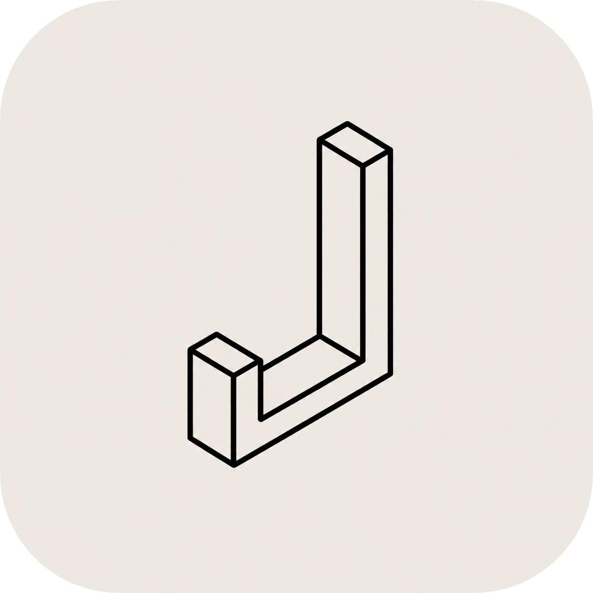

# Joint

<p align="center">
  <a href="https://github.com/y0ncha/joint/actions/workflows/ci.yml">
    
  </a>
  <a href="LICENSE">
    
  </a>
  <a href="https://nextjs.org/">
    
  </a>
  <a href="https://react.dev/">
    
  </a>
  <a href="https://supabase.com/">
    
  </a>
  <a href="https://bun.sh/">
    
  </a>
  <a href="https://ui.shadcn.com/">
    
  </a>
  <a href="https://sentry.io/">
    
  </a>
</p>

<p align="center">
  <a href="https://tailwindcss.com/">
    
  </a>
  <a href="https://www.radix-ui.com/">
    
  </a>
  <a href="https://lucide.dev/">
    
  </a>
  <a href="https://zod.dev/">
    
  </a>
  <a href="https://vitest.dev/">
    
  </a>
  <a href="https://cva.style/docs">
    
  </a>
  <a href="https://github.com/lukeed/clsx">
    
  </a>
  <a href="https://github.com/dcastil/tailwind-merge">
    
  </a>
</p>

Joint is a calm shared household-money app for two people. It records manual income and expenses in Israeli shekels (ILS) against one shared balance.

## What it is

Joint is deliberately small: one household, one opening balance, categories, and transactions. The balance is calculated as opening balance + income − expenses, and may be negative.

It is not a bank connection or a personal-budgeting tool. Accounts, cards, transfers, recurring transactions, imports, attachments, and financial credentials are outside the MVP.

## How to use it

1. Request access from the project owner by GitHub direct message. Access requires their explicit authorization.
2. Sign in with the authorized Google account.
3. Open or create the household's categories and opening balance.
4. Add income and expense transactions; the dashboard and transaction list show the shared household view.
5. An owner can authorize one partner email in Settings. The partner can access data only after joining as a household member.

There is no self-service owner onboarding. A future owner must first sign in, then an operator provisions the household using the [owner provisioning procedure](docs/architecture/operator-owner-provisioning.md).

## Run locally

Copy `.env.example` to `.env.local`, then set the development Supabase URL and publishable key.

```bash
bun install
bun run dev
```

Open `http://127.0.0.1:3000`. The development Google OAuth callback is `http://127.0.0.1:3000/auth/callback`; add new development users to the OAuth consent screen's test-user list before they sign in.

Run the checks before submitting changes:

```bash
bun run lint
bun run test
bun run build
```

## Security

- Google sign-in proves identity; `household_members` is the authorization boundary for household data.
- Access is granted only after explicit approval from the project owner via GitHub direct message; GitHub is the approval channel, not the technical access control.
- Supabase Row Level Security protects every household-owned record. Unmatched users are signed out and shown an access-denied message.
- Persistent changes run through authenticated Server Actions. The browser receives only the Supabase publishable key—never a service-role key, database password, or provider secret.
- Keep `.env.local` private. Optional integration-test credentials may be set locally; do not use production credentials.
- Database changes are ordered migrations. A production rollback changes application code only; schema recovery is a forward fix or Supabase recovery.

## Learn more

- [Agent guide](AGENTS.md) — contribution workflow and project rules.
- [Design system](docs/design.md) — product and accessibility contract.
- [Architecture](docs/architecture.md) — runtime, data, and security boundaries.
- [Changelog](CHANGELOG.md) — released changes.
- [Contributing](docs/CONTRIBUTE.md) — local setup, Supabase development, and contribution workflow.

## Credits

- Logo: [Letter J icon](https://www.flaticon.com/free-icons/letter-j) created by [Md Tanvirul Haque](https://www.flaticon.com/authors/md-tanvirul-haque) on Flaticon.
